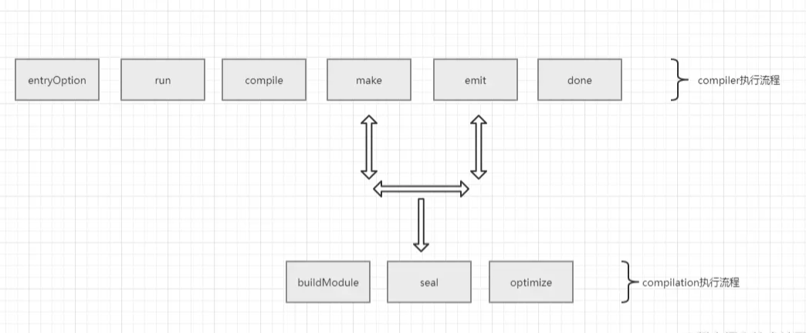

# Webpack plugin

whole webpack application is built upon the plugin system.

webpack's whole packaging flow is cutted into pieces of plugins



## Compiler is the webpack's supporting engine, for controlling how webapck works

in compiler, there some hooks will be executed, the most important hooks are [
entryOptions(
webpack start to read config file's entry point,
and iterate all entry files
),
run(
webpack will start to run
),
compile(
webpack will create the compilation
),
make(
the compilation starts,
create compilation object,
compilation object start to compile and build
),
emit(
dependency graph build finish, will emit the dependency graph into the file,
),
done(
whole process finished
)
]

compilation will execute the do the actually compilation, compilation also defined several hooks for plugin [
buildModule(
acivited before the module start to build
),
seal(
build process finish, compilation stop receive any new module
),
optimize(
start to optimize the module
)
]

```js
const webpack = require('webpack')
const options = require('path-to-option')
const compiler = webpack(options)

compiler.run()
```

When compiler enter the make phase, compilation instance will be create, the compilation will first trigger the buidModule hook, at the same time, compilation instance will enter every entry file and use corresponding loader to compile the code to `AST`.
When the compile is done, use acorn to `parse` the `AST` .
<br>
all module and dep finish analyze, compilation will enter seal phase, and organize every chunk
<br>

## Tapable

### Sync Hook

```js
const { SyncHook, AsyncSeriesHook } = require('tapable')

// ['arg1', 'arg2'] => list of argument names as string
const prepareHook = new SyncHook(['arg1', 'arg2'])

prepareHook.tap('hook1Plugin', (arg) => {
  console.log('hook1', arg)
})

prepareHook.tap('hook2Plugin', (arg) =>
  console.log('hook2', arg),
)

prepareHook.tap('hook3Plugin', (arg) =>
  console.log('hook3', arg),
)

prepareHook.call('prepare')

// hook1 prepare
// hook2 prepare
// hook3 prepare

const workHook = new AsyncSeriesHook(['arg1'])
workHook.tapAsync('1', (arg, next) => {
  setTimeout(() => {
    console.log('1', arg)
    next()
  }, 1000)
})

workHook.tapAsync('2', (arg, next) => {
  setTimeout(() => {
    console.log('2', arg)
    next()
  }, 1000)
})

workHook.callAsync('aaaaa', () => console.log('all done'))
```

## plugin

```js
class CopyRightPlugin {
  doPlugin(compilation, next) {
    setTimeout(() => {
      compilation.assets['copyright.txt'] = {
        source() {
          return 'this is copyright'
        },
        size() {
          return 20
        },
      }
      next()
    }, 1000)
  }

  apply(compiler) {
    compiler.hooks.emit.tapAsync(
      'CopyRightPlugin',
      (compilation, next) => {
        this.doPlugin(compilation, next)
      },
    )
  }
}

module.exports = CopyRightPlugin
```
